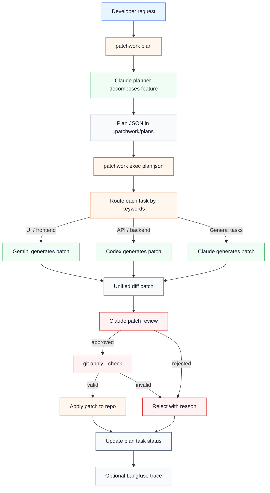

# Complete Flow

This diagram is the client-facing overview of Patchwork.

Patchwork starts with a feature request, asks Claude to break it into small tasks, routes
each task to the best coding assistant, reviews the generated patch, validates it with
`git apply --check`, and only then applies approved changes to the repository.

Use this when explaining the core value proposition:

- Work is split into small, trackable tasks.
- Different assistants are used for the work they are best suited to.
- Every patch goes through a review and validation gate before touching code.
- Execution state is saved back to the plan file.
- Model calls can be traced in Langfuse for observability.

