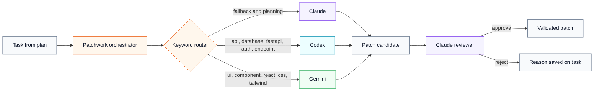

# Agent Orchestration

Patchwork acts as the coordinator between multiple AI coding assistants.

The router looks at each task description and chooses a backend. Frontend-shaped work goes
to Gemini, backend/API-shaped work goes to Codex, and general planning or fallback work goes
to Claude. Claude also acts as the patch reviewer before changes are applied.

Use this when explaining why Patchwork is not tied to one model:

- It routes work by task type.
- It can use local CLI subscriptions by default.
- It keeps a consistent review gate even when generation comes from different agents.

