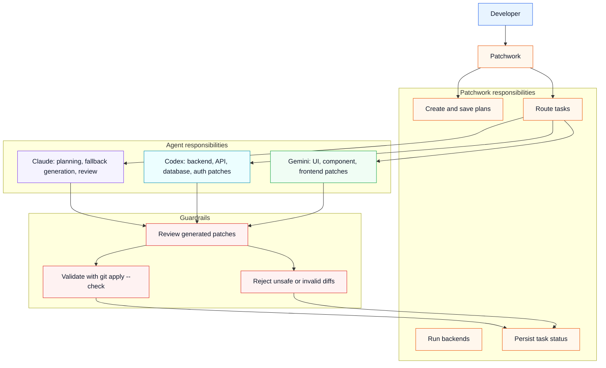

# Agent Responsibilities

This diagram separates what Patchwork owns from what each assistant owns.

Patchwork is the orchestrator. It does not ask agents to edit the worktree directly. It asks
them for patches, then runs review and Git validation gates before applying anything.

Use this when explaining operational control:

- Patchwork owns planning, routing, execution, validation, and status.
- Claude owns planning and review, and can also handle general tasks.
- Codex is preferred for backend/API/database-shaped work.
- Gemini is preferred for frontend/UI-shaped work.
- The Git validation gate decides whether an approved patch can touch the repository.

